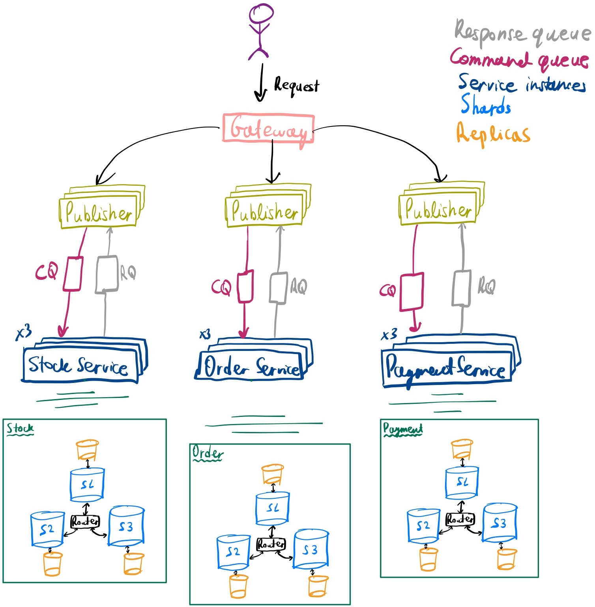

# Web-scale Data Management Project Group 14

## Architecture Overview

This project implements a microservices system consisting of Order, Stock, and Payment services that interact. The transaction protocol uses SAGA, with a focus on fault tolerance, high availability, and eventual consistency.

The system consists of the following components:

- **Gateway**: Acts as the entry point for client requests.

- **Publishers**: Responsible for dispatching requests to services and also listens for asynchronous responses.

- **Stock, Order, and Payment Workers:** Each handles their specific domain. Each has multiple instances for reliability (x10 workers) .

- **RabbitMQ**: Used for asynchronous communication between services and clients. Also used for retries assuming worker dies intermittently. 

- **Sharded Databases**: Each worker/service maintains a distributed database with failover mechanisms (x3 master x3 replica)

### Database
The database uses a **cluster of Redis nodes** for data storage, with each node serving a shard. If a node (master) fails, a replica is promoted to master. Replicas are for failover purposes and do not serve requests directly.

**Sufficiency checks** are used during stock and payment processing to prevent issues such as dirty reads, lost updates, and non-repeatable reads.

We use temporary locks with TTL to ensure that two transactions do not touch a critical path at the same time. Furthermore, we enforce a TTL on locks so that no deadlocks occur. 

### Important Notes
- **Startup Time:** Please start issuing requests only after the entire system is up and running. This process takes approximately 30 seconds.

- **Service Kill Policy:**
  - **Do not kill Gateway or Publishers,** as Publishers maintain local state for response listening. Killing them might cause **consistency issues**. 
  - Killing a **DB container** will lead to consistency issues during `consistency_test.py` due to the **exponential backoff strategy** and **queue retry strategy**. The DB failover stalls the retry until NGINX prematurely closes the connection with a 502 error.
  - Killing queue will stop the system, see the reasons below why we didn't build redundancy into our queue. 

#### Why We Didn't Distribute the Event Queue
- NGINX prematurely closes connections, causing consistency issues as the client expects a synchronous response. In a usual setting, we could do this using retry queues, however, this would be of no use since this would cause inconsistencies with NGINX killing the connection.
- Maintaining a centralized queue helps avoid unnecessary complexity and potential race conditions.
- For this reason we also disabled the inbuilt message durability option that RabbitMQ offers which means messages are not persisted, this was done to increase throughput.

#### Consistency Guarantees
- Our system guarantees eventual consistency.
- Failover strategies and retry mechanisms ensure that requests are eventually processed, even in the presence of failures.
    - The queue retries sending if it doesn't receive an `ack()`
    - Idempotency keys on `POST` and `PUT` operations.

-----------

Basic project structure with Python's Flask and Redis. 

### Project structure

* `env`
    Folder containing the Redis env variables for the docker-compose deployment
    
* `helm-config` 
   Helm chart values for Redis and ingress-nginx
        
* `k8s`
    Folder containing the kubernetes deployments, apps and services for the ingress, order, payment and stock services.
    
* `order`
    Folder containing the order application logic and dockerfile. 
    
* `payment`
    Folder containing the payment application logic and dockerfile. 

* `stock`
    Folder containing the stock application logic and dockerfile. 

* `test`
    Folder containing some basic correctness tests for the entire system. (Feel free to enhance them)

### Deployment types:

#### docker-compose (local development)

After coding the REST endpoint logic run `docker-compose up --build` in the base folder to test if your logic is correct
(you can use the provided tests in the `\test` folder and change them as you wish). 

***Requirements:*** You need to have docker and docker-compose installed on your machine. 

K8s is also possible, but we do not require it as part of your submission. 

#### minikube (local k8s cluster)

This setup is for local k8s testing to see if your k8s config works before deploying to the cloud. 
First deploy your database using helm by running the `deploy-charts-minicube.sh` file (in this example the DB is Redis 
but you can find any database you want in https://artifacthub.io/ and adapt the script). Then adapt the k8s configuration files in the
`\k8s` folder to mach your system and then run `kubectl apply -f .` in the k8s folder. 

***Requirements:*** You need to have minikube (with ingress enabled) and helm installed on your machine.

#### kubernetes cluster (managed k8s cluster in the cloud)

Similarly to the `minikube` deployment but run the `deploy-charts-cluster.sh` in the helm step to also install an ingress to the cluster. 

***Requirements:*** You need to have access to kubectl of a k8s cluster.

## Group related info
- If you want to update the requirements.txt to bring a dependency in. add your dependencies in `requirements.txt` in the project root. Then, run the update-requirements.sh script. It will override all the other ones.

## Outdated Information (I think)

> They said we are only allowed to use python and k8s was unnecessary in the lecture.

**You are free to use any web framework in any language and any database you like for this project.**